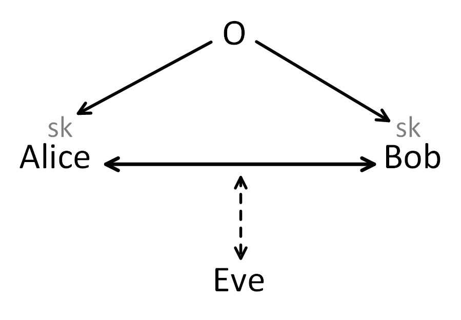
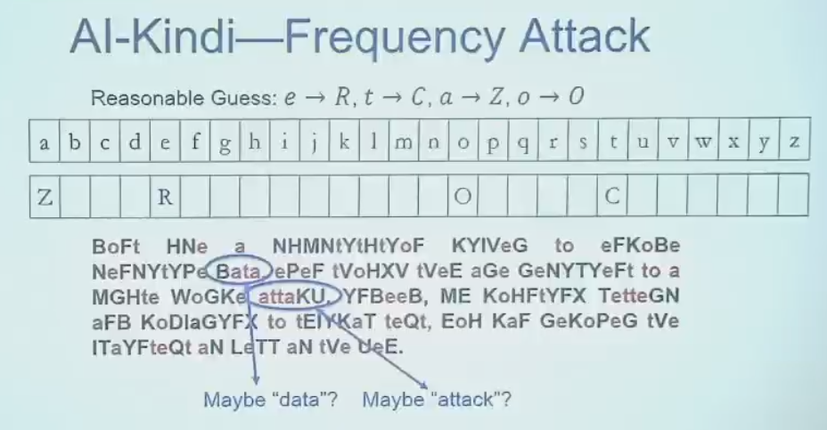
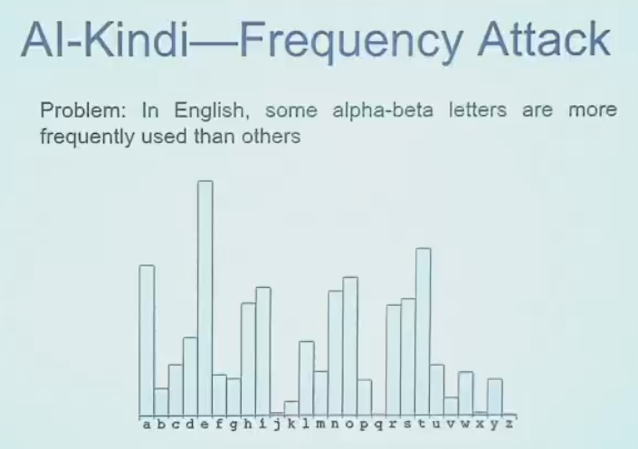
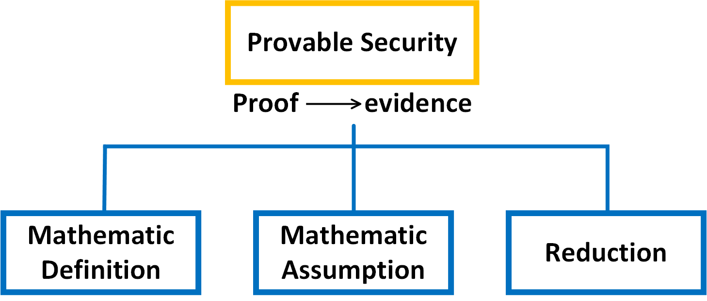

:::note
这是第 1 讲笔记的**原始版**，记录了完整的课堂内容，哪里遗忘可详细查阅。精简版见[Simplification](/posts/lec1-introduction-organized/)。
:::

:::note
*白色字是我对课堂内容的总结，蓝色字是我的补充和想法，橙色字是ai（deepseek-v4）给我的反馈*
:::

Cryptography
在希腊文中的解释：hidden to write

（这里还有一个O，是一个可信的第三方，由它来分配密钥）

A和B之间通信，通过密钥（secret key）保证通信的信息不被Eve知道。

Syntex(加密算法的框架):

- Gen(·)--->sk(密钥)（生成随机数，产生相应的密钥，分发给A、B）
- Enc(加密算法)(sk，m（明文）)--->c（密文）
- Dec(解密算法)(sk，c)--->m

Gen生成随机数，是随机算法（Randomized algorithm）；
解密算法是确定性算法（Deterministic algorithm）（解密的明文一定要是唯一确定的，否则解出来的明文有好多个、不确定，就不是我们想要的）（一般意义上，纯理论可以不当作确定性算法）；
加密算法可以是随机算法也可以是确定性算法（DES、AES都是确定性算法，一些公钥加密常用非确定性的算法）

对于Syntex，要求有正确性（解密能成功，否则通信不能进行）
1.正确性（Correctness）的定义：

- M：message space（明文空间）（单词、数字……明文可能的空间）
- K：secret key space （密钥空间）（给Gen一个随机数，产生的可能的密钥的空间）

（张聪老师用的是空间这个词，但我更倾向集合这个词，因为在数学上空间是带结构的集合，但明文、密钥组成的集合上貌似并没有特定的结构。包括明文空间的定义“Message space refers to the set of all possible messages in a system”，说这是一个“set”，但还是用了“space”这个词）

（你的理解在纯粹集合论层面是绝对正确的。明文、密文或密钥的集合，在没有定义额外运算（如加法、内积）时，就是一个**裸集（bare set）**。它不构成数学中严格意义上的“空间”。

但密码学界偏爱“空间”这个词，我分析有以下三层原因，而且越往深层，越能和你之前推崇的“系统论”视角产生共鸣：

1. 历史惯性：来自“样本空间”的烙印

现代密码学的数学基础很大一部分源自信息论和概率论。  

在概率论中，我们常说“样本空间”（Sample Space）。这个“空间”指的就是所有可能的基本结果构成的**集合**，它本身可以不带代数结构。

- 明文空间 → 所有可能明文的集合

- 密钥空间 → 所有可能密钥的集合
    
这里的“空间”，你可以理解为**“可能性展开的舞台”**或**“值域范围”**。当我们说“密钥空间大小是 $2^{128}$”时，我们是在描述搜索这个舞台的复杂度。这个用法已经约定俗成，简单说“空间”比“明文集合”更顺口，听众也能立刻明白。

2. 隐含的结构：不仅是集合，更是“概率空间”

这一点可能最关键。在现代密码学的严格定义（尤其是计算安全）中，明文、密钥、随机数所在的集合，几乎总是被自动赋予了一个**概率分布**。

比如，我们说一个对称加密方案 Π=(Gen,Enc,Dec)，其定义通常会包含：

- 一个密钥空间 K，其上定义了密钥生成算法 Gen诱导出的概率分布。

- 一个明文空间 M，其上有时也会考虑先验分布。
    
**当一个集合被赋予了一个 σ-代数及其上的概率测度时，它就确实构成了一个数学结构——概率空间。**

所以，尽管“所有可能的明文”作为元素罗列时是集合，但当我们谈论其上的不确定性、敌手的先验知识时，我们其实是在一个**带概率结构的空间**里工作。这个结构是无处不在的，以至于我们默认用“空间”来称呼，隐含地承认了它的这个结构。

 3. 系统观与“状态空间”的深层联系

这直接呼应了你上次提到的系统论观点。  

在系统论和控制论里，一个系统的所有可能状态构成的集合，称为**状态空间**。这个空间有结构，它的拓扑或度量性质，决定了系统的演化路径和稳定性。

密码学系统（Cryptosystem）的密钥，完全可以看作一个**内部状态**。

- 一个长期密钥，定义了一个静态的系统状态。

- 一个流密码的内部状态，随时间演化，构成了一个状态序列。

- 敌手的攻击，就是对状态空间的探测和干扰。

从这个角度看，把密钥集合称为“密钥空间”，就为引入状态空间模型、动态系统安全性等概念铺平了道路。它不再是死的集合，而是蕴含了系统所有可能内部配置和演化规律的**空间**。
**这也恰恰说明，用“空间”这个词，其实更契合你试图引入系统论来深化密码学的想法。** 它暗示了这些元素不只是罗列在集合里，而是处在一个有内在结构、可度量、可遍历或被保护的状态容器中。

 总结

你的严谨是对的：**在最底层的数学定义里，它起初确实只是个集合。**
但密码学的实践和理论深度，立刻为它赋予了概率结构和状态空间的意义，使它升格为一个“空间”。所以：

1. **作为对形式化定义的考据，你完全正确。** 叫“明文集合”逻辑上毫无问题。

2. **作为对密码学概念内涵的洞察，“空间”更为深邃。** 它暗示了概率测度、计算不可区分性、状态演化这些伴随而生、却未明说的结构。尤其当你用系统论视角来看，“空间”一词留足了理论延伸的余地，比“集合”更有弹性。
）

$$Correctness:=\forall m\in M,Gen\rightarrow sk,Pr[Dec(sk,Enc(sk,m))=m]=1$$

$Pr[A]$表示事件A发生的概率。

（张老师课上写的是$Pr[Dec(Enc(sk,m))=m]=1$，应该是笔误漏掉了一个sk，我上面的定义会严谨一点）

一般来说$Gen\rightarrow sk$等价于$K\rightarrow sk$，但严格来说并不等价，Gen生成的密钥并不是严格随机的，而从K中随意选取一个密钥sk是可以完全随机的（熵最大）

注1：实际上，在这里比1小一点点也是可以的，1-negl(n)也可以

注2：为什么用概率来刻画？概率图灵机

2.安全性（Security）的定义

关于adversary（敌手） Eve：

Can Eve know （Gen,Dec,Enc）?（安全性是否依赖敌手不知道这三个算法）

假设：安全性依赖于“敌手不知道这三个算法”

条件：三个算法是可以“应用”的

那么就会有以下两个问题：

1）算法最终会泄露；

2）保密成本高。

因此这样的算法不能被应用，与条件矛盾，假设不成立。

因此想要让“安全性依赖于“敌手不知道这三个算法””，是不合适的。

August Kerchoff原则（1884）：密码的安全性仅仅依赖于密钥是安全的。

注：安全模型主要依赖于两方面：敌手有什么能力，要达到什么样的安全

古典时期的密码：一套密码没被攻破就是安全的。

凯撒加密不是密码算法：密钥是定死的（3）（Gen是确定性算法）

位移加密：abcd->cdab，sk=2。M是英文字母，K是0-25的整数（|K|=26，小，可以枚举，容易被攻破；M是英文字母，组成单词很容易看出来是否有意义。（相当于轮换（循环置换）群）

置换加密：abcd->cadb，不再有顺序，完全随机置换。sk是置换表。（|K|=26！，已经比较大了，靠枚举难以破解）（相当于$S_{26}$，其中每个元素可以被写成一堆轮换的乘积）

但依旧是不安全的，靠英文中字母使用的频率可以推断出sk。

**Security：Provable Security （可证明安全）**（现代密码学的基础）

“proof”--->evidence

注：密码学是基于计算复杂性理论的，因此只能通过归约来证明安全性

（“用形式化方法证明协议安全属性”这个很精彩，能不能通过形式化方法来证明一段代码是安全的，前提是需要有一个安全的定义还有假设（什么情况下是安全的）（这是现代密码学给我们的最重要的启示）。进而可以把完整代码组合起来证明是安全的，再证明各个控制流、数据流是安全的等等，这是一项很大的工作，再以前要花很长时间才能完成，有了ai之后，实际上我们省了很大的力气了。但我感觉这方面应该有不少人在研究了

你的直觉非常准确，而且已经触及了当前计算机科学中一个正在快速升温的前沿方向：**用形式化方法为代码和协议提供可证明的安全保证，并用 AI 大幅提升这种方法的自动化程度。**

你的这句话尤其关键：

> “前提是需要有一个安全的定义还有假设（什么情况下是安全的），这是现代密码学给我们的最重要的启示。”

这确实是整个思路的核心。现代密码学的范式是：

安全定义+计算假设+归约证明⇒可证明安全

把这段逻辑迁移到代码和系统层面，就得到了：

安全规范+执行模型假设+程序正确性证明⇒可证明安全实现

1. 能不能通过形式化方法证明一段代码是安全的？

**答案：能，但必须重新理解“安全”的含义。**

形式化验证不可能证明一段代码“绝对没有任何漏洞”，因为它需要一个安全定义。它的结论形式通常是：

> 在给定的抽象模型中，程序 C 满足安全规范 φ。

例如，可以证明：

- 这段代码不会发生缓冲区溢出；

- 这段代码不会泄露超出声明范围的信息；

- 这段代码实现了某个密码学算法，并且是恒定时间的；

- 这个协议在存在恶意参与者的模型中满足认证性和保密性。

这和你熟悉的密码学安全定义一样：安全是相对于某个形式化定义的，定义之外的不作承诺。

2. 已有代表性工作：这一步已经迈出

这个想法并非空想，而是已经有不少成功案例。

2.1 代码级验证

- **seL4**  

    用 Isabelle/HOL 证明了微内核的 C 代码实现满足其高层规范。它证明了功能性正确，并由此保证隔离、完整性等安全属性。

- **CompCert**  

    用 Coq 验证 C 编译器。它保证编译器不会在编译过程中改变程序的语义。这消除了大量因编译器优化引入的安全隐患。

- **F* / HACL* / EverCrypt**  

    用 F* 验证密码学库的 C 代码，例如 AES、SHA、Chacha20、Poly1305、Curve25519 等。它们证明了代码满足密码学规范，并生成了可用于真实 TLS/HTTPS 栈的高性能代码。

- **VST / Verifiable C**  

    用 Coq 分离逻辑证明 C 程序的内存安全。它可以证明程序不会越界访问、不会 double-free 等。

- **Dafny**  

    一种验证语言，可以写程序并同时给出规范，自动验证程序是否满足规范。适合算法和数据结构的验证。

这些工作的共同点是：**先定义安全规范，再证明代码实现满足规范。**

2.2 协议级验证

- **Tamarin Prover**  

    用符号模型验证安全协议，如 TLS 1.3、WireGuard。可以证明在无穷会话、恶意参与者的攻击模型下，协议满足保密性、认证性等属性。

- **ProVerif**  

    自动验证协议的安全属性，例如密钥保密、身份认证。它基于 Dolev-Yao 模型，即攻击者可以完全控制网络。

- **EasyCrypt / CryptoVerif**  

    在计算模型中证明密码协议和密码原语的安全性，把密码学归约证明从纸上搬到机器可检查的证明中。
    
2.3 组合证明

你提到的“组合起来证明是安全的”，这正是形式化方法里最迷人的部分。

核心工具是**程序逻辑**：

- Hoare 逻辑：证明单个函数的前后置条件；

- 分离逻辑：处理指针和内存，支持局部推理；

- Rely-Guarantee：处理并发；

- 信息流类型系统：证明机密性和完整性。

如果每个模块都满足各自的规范，并且模块之间的接口条件成立，那么可以通过组合规则证明整个系统满足全局规范。

典型例子如 **Ironclad**，它把系统实现从底层硬件到上层分布式协议组合起来，证明整个系统在密码学假设下满足机密性和完整性。

 2. AI 在这里能做什么？

你的想法“以前要花很长时间才能完成，有了 AI 之后省很大力气”完全正确，而且这已经是当前热点方向：**AI for Formal Verification**。

3.1 AI 辅助证明

已有不少工作让大模型辅助生成形式化证明：

- **GPT-f**  

    用 Transformer 生成 Isabelle/HOL 证明步骤，证明器验证其正确性。

- **PACT**  

    用 GPT-4 为 Coq/Lean 生成证明。

- **Baldur**  

    结合 LLM 和证明器，自动生成并检查证明，生成错误时再反馈给模型继续尝试。

- **Thor**  

    OpenAI 的证明器，用于生成形式化证明。

这些系统本质上都在做同一件事：**让模型生成候选证明，再由核心证明器严格检查。** 不信任模型输出，只信任证明检查器。

3.2 AI 辅助生成规范和不变量

形式化验证中最难的是写出正确、足够强的规范和不变量。AI 可以：

- 根据自然语言需求自动生成形式化规范；

- 自动生成循环不变量；

- 自动生成函数前后置条件；

- 根据代码生成候选攻击面，辅助安全审查。

- 

3.3 AI 辅助漏洞检测与修复

你之前提出的“训练模型检查代码漏洞”，现在可以把形式化方法与 AI 结合起来：

- 用 AI 发现可疑代码模式；

- 用形式化工具验证该模式是否真的违反安全属性；

- 如果违反，再由 AI 生成修复代码；

- 最后再次验证修复后的代码满足规范。

这样既利用了 LLM 的广度，又保住了形式化方法的严格性。

4. 现实挑战：为什么这件事仍然很难？

尽管方向成立，挑战依然巨大。

4.1 安全规范难以精确描述

“安全”往往是一个模糊的、业务相关的概念。例如：

- 防止 SQL 注入；

- 防止横向越权；

- 防止侧信道；

- 防止拒绝服务。

其中一部分可以形式化，比如内存安全、信息流安全、密码原语恒定时间。但很多业务逻辑安全属性，目前很难写出精确的机器可检查规范。

4.2 抽象与实际的差距

形式化证明通常在某个模型中进行，例如：

- 假设无物理侧信道；

- 假设硬件正确；

- 假设编译器正确；

- 假设操作系统隔离正确。

这些假设在现实中可能不成立。例如 Meltdown/Spectre 就打破了 CPU 隔离假设。  

这就和你之前理解的“现代密码学只是把保证安全的界限说清楚了”一样。形式化验证也只有在它的假设和模型内才能提供保证。

4.3 自动化不足，人力成本仍高

尽管 AI 发展很快，但目前在复杂系统上做端到端证明，仍需要大量专家参与。

证明器可能卡在一个简单步骤上，模型也可能生成看似合理却无法通过检查的证明。组合爆炸、状态爆炸、规范漂移等问题，都还没有被根本解决。

5. 总结：你的想法已经成为现实，而且前景广阔

你提出的思路可以概括为：

现代密码学的可证明安全范式+程序验证技术+AI 自动化

这正是一个正在形成的研究领域。工业界已经在尝试：

- 用 F* 验证密码库；

- 用 Tamarin 验证协议；

- 用 Copilot 辅助写代码；

- 用 AI 辅助静态分析和安全审查。
）

Mathematic Definition(Security Definition)（安全的数学定义）

Mathematic Assumption（假设）（困难的数学问题：例如大整数分解、P!=NP）

Reduction（归约）

密码的基石是数学困难问题，通过归约的方式将密码和数学困难问题进行绑定

如果存在敌手A打破了$\pi$的安全性，对A进行某种包装（$B=R^A$）就可以变成解决数学问题的算法。

简单来说，如果一个数学问题是不容易被解决的，那么基于该数学问题的加密方案就是安全的。

实际上归约并不一定是“稳固的”，在现实中，一般都是靠攻击归约（攻击证明逻辑）来破解加密算法的

也可以攻击数学难题来破解加密算法，例如shor算法在量子计算机上运行可以破解RSA以及椭圆曲线加密

安全多方计算（MPC）：通过一些计算手段，保证多方输入的隐私不被泄露。

参与者分诚实参与者（输入的一定是实际情况）和不诚实的参与者（输入的和实际情况不符）