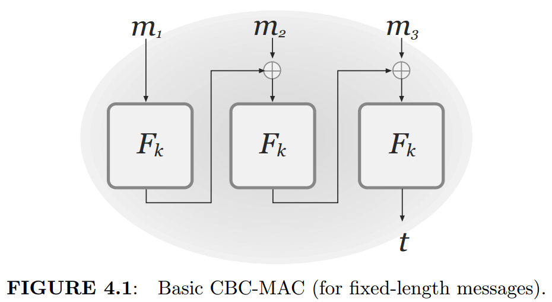

:::note
这是第 8 讲笔记的**原始版**，记录了完整的课堂内容，哪里遗忘可详细查阅。精简版见[Simplification](/posts/lec8-cbc-mac-padding-oracle-organized/)。
:::

:::note
*(白色字是对课堂内容的总结，蓝色字是我的补充和想法，橙色字是 AI 给我的反馈)*
:::
## 由 PRF 构造 MAC

$Gen(1^n) \rightarrow sk$

$MAC(sk,m) \rightarrow F_{sk}(m)$

$Verify(sk,t,m) \rightarrow \delta(MAC(sk,m),F_{sk}(m))$

函数 $\delta(\_,\_)$ 表示两者相等出 1，不一样出 0。

当 $F_{sk}(\cdot)$ 是 PRF 时，$F_{sk}(\cdot)$ 长得像真随机的，猜出 $F_{sk}(m)$ 的概率是 $\dfrac{1}{2^n}+negl(n)$（$\dfrac{1}{|\mathbb{C}|}+negl(n)$，$\mathbb{C}$ 是 $F_{sk}(m)$ 可能的取值组成的集合，$|\mathbb{C}|=2^n$）

> **Un-Forgeability against Chosen-Msg Attacks**
>
> 1. 挑战者 Ch 与敌手 A 共享随机函数 Gen()、MAC()、认证函数 Verify()
> 2. $sk\leftarrow \{0,1\}^n$。A 多次发送明文 $m_i$，Ch 多次返回 $MAC_{sk}(m_i)$，直到 A 不想发送为止，共计发送 q 个明文对
> 3. **A 发送 $m'_j,t'_j$，Ch 返回 $Verify(sk,m'_i,t'_i)$**
> 4. A 发送 $m^*,t^*$，我们将 A 赢了定为 $Verify(sk,m^*,t^*)=1$，即
>
> $$Pr[Awins]=Pr[Verify(m^*,t^*)=1]$$
>
> $m^* \neq m_i$，即 $\{m_i\}$ 中不能有 $m^*$ 出现

PRF：$F_{sk}(\cdot):\{0,1\}^n \rightarrow \{0,1\}^n$ 只能对固定长度为 n-bit 的明文进行加密，因此我们下面考虑对任意长度（Arbitrary length）的明文进行加密：

$m=m_1||m_2||\dots||m_s,\quad |m_i|=n\ \text{bit}$

**Attempt 1：**

$$MAC(sk,m)=F_{sk}(m_1)||F_{sk}(m_2)||\dots||F_{sk}(m_s)$$

这是不满足 UF-CMA 安全的。实际上，我们可以构造 $m'=m_2||m_1||\dots||m_s$，仅 $m_1$ 和 $m_2$ 交换位置，其余都一样。在 UF-CMA 的 Game 中，敌手 A 可以询问 $m'$ 后将其进行如上加密，得到 $MAC(sk,m')=F_{sk}(m_2)||F_{sk}(m_1)||\dots||F_{sk}(m_s)$，再将 $F_{sk}(m_2)$ 与 $F_{sk}(m_1)$ 调换位置就得到 $MAC(sk,m')'=F_{sk}(m_1)||F_{sk}(m_2)||\dots||F_{sk}(m_s)=:t$，发送 $(m=m_1||m_2||\dots||m_s,\ t)$ 即可获得游戏胜利。

**Attempt 2：**

$$MAC(sk,m)=F_{sk}(1||m_1)||F_{sk}(2||m_2)||\dots||F_{sk}(s||m_s)$$

这也是不满足的。我们可以构造 $m^*=m_1||m_2||\dots||m_k,\ k<s$，即取 $m$ 的子串。在 EUF-CMA 的 Game 中，敌手 A 可以询问 $m$，得到 $MAC(sk,m)=F_{sk}(1||m_1)||F_{sk}(2||m_2)||\dots||F_{sk}(s||m_s)$，再取前 $k$ 块得到 $MAC(sk,m^*)=F_{sk}(m_1)||F_{sk}(m_2)||\dots||F_{sk}(m_k)=:t$，发送 $(m^*,t)$ 即可获得游戏胜利。

**Attempt 3：**

$$MAC(sk,m)=F_{sk}(s||1||m_1)||F_{sk}(s||2||m_2)||\dots||F_{sk}(s||s||m_s)$$

这也不安全。考虑一种"嫁接"的想法：询问 $m=m_1||m_2||\dots||m_s$ 和 $m'=m'_1||m'_2||\dots||m'_s$，返回 $MAC(sk,m)=F_{sk}(s||1||m_1)||\dots||F_{sk}(s||s||m_s)$ 和 $MAC(sk,m')=F_{sk}(s||1||m'_1)||\dots||F_{sk}(s||s||m'_s)$，只需要构造 $m^*=m'_1||m_2||\dots||m_s$，即把 $m'_1$ 替换掉 $m$ 中的 $m_1$，对于 MAC(sk,m) 把 $F_{sk}(s||1||m_1)$ 替换成 $F_{sk}(s||1||m'_1)$，即得 $MAC(sk,m^*)=F_{sk}(s||1||m'_1)||F_{sk}(s||2||m_2)||\dots||F_{sk}(s||s||m_s)=:t$，发送 $(m^*,t)$ 即可获得游戏胜利。

**Attempt 4：**

$$MAC(sk,m)=F_{sk}(r||s||1||m_1)||F_{sk}(r||s||2||m_2)||\dots||F_{sk}(r||s||s||m_s)$$

$$t=(r,MAC(sk,m))\quad(\text{r 是 t 的输出的一部分，否则攻击者没法验证})$$

$r$ 是完全随机的，且独立于消息 $m$，每次进行 MAC 加密时都有不同的 $r$。这保证了不同的 $m$ 之间的 MAC 不能相互替换。当 $F_{sk}(\cdot)$ 是 PRF 时，这是 **UF-CMA 安全**的（用 Hybrid Argument 证明）。

（

**Game 0：真实世界**

使用真实 PRF 密钥 $k$，标签为：

$$\tau=(r,F_k(r||s||1||m_1),\dots,F_k(r||s||s||m_s))$$

其中每次查询随机选 $r \leftarrow \{0,1\}^n$。

**Game 1：随机函数世界**

真随机函数 $f:\{0,1\}^* \rightarrow \{0,1\}^n$

标签变为：

$$\tau=(r,f(r||s||1||m_1),\dots,f(r||s||s||m_s))$$

两个 Game 不可区分，因为 $F$ 是安全 PRF，所以任何 PPT 敌手都不能区分自己是在 Game 0 还是 Game 1。

因此：

$$Pr[A\ win\ Game0] \leq Pr[A\ win\ Game1]+negl(n)$$

现在设底层是均匀随机函数 $f$，设敌手一共进行了 $q$ 次查询，得到 $(r_j,f(r_j||s_j||1||m_{j,1}),\dots,f(r_j||s_j||s_j||m_{j,s_j}))$，其中 $j=1,\dots,q$。

i) $r_j$ 中有两个相同的情况。由于每次查询的 $r_j$ 都是随机选择的，两个查询选到相同 $r_j$ 的概率不超过

$$\frac{q(q-1)}{2}\cdot 2^{-n}$$

ii) 所有 $r_j$ 互不相同的情况。现在敌手要输出一个伪造 $(m^*,\tau^*)$，$m^*\notin\{m_1,\dots,m_q\}$，其中 $\tau^*=(r^*,y_1^*,\dots,y_{s^*}^*)$。

如果 $r^*$ 和之前所有 $r_j$ 都不同，那么所有输入 $r^*||s^*||i||m_i^*$ 都从未被查询过，于是对应的 $f$ 值对敌手来说都是均匀随机且独立的。

如果 $r^*$ 和某个 $r_j$ 相同，那么由于 $m^*\neq m_j$，至少存在一个块 $i$ 使得 $m_i^* \neq m_{j,i}$（相等了就在查询里出现过了）或者总块数 $s^*\neq s_j$。无论哪种情况，至少有一个输入 $x=r^*||s^*||i||m_i^*$ 没有在之前的任何查询中出现过。

因此，标签 $\tau^*$ 中至少有一个位置的值 $f(x)$ 对敌手来说是完全均匀随机的。

敌手要成功，必须正确猜出这个值。而该值在 $\{0,1\}^n$ 中均匀随机，猜中概率为 $2^{-n}$。

所以：

$$Pr[A\ win\ Game1]\leq \frac{q(q-1)}{2}\cdot 2^{-n}+2^{-n}\leq \frac{q^2}{2^n}+2^{-n}$$

这是可忽略的。故 $Pr[A\ win\ Game0]\leq negl(n)$，因此该 MAC 是 UF-CMA 安全的。

）

（这个 MAC 的构造方式有点经验性的，只是把三个东西并到一起加密，这三个东西分别代表了三种操作，加数字编号避免不同的块可以交换，加块数 $s$ 避免取子串，加 $r$ 避免不同的 $m$ 交叉。我还有一种比较数学的证明思路，即任意把 MAC 变成另一个 MAC 的"映射"只能是交换、取子串、交叉这三种操作的复合，避免了这三者就能实现 UF-CMA 安全。任意映射只能是三种操作的复合，就是说攻击者对消息内容做的任意修改只能是交换、截取、交叉的复合，比如改变块数 $s$ 就是取子串，拼接可以看成取子串的逆操作，混合就是交叉。如果存在一种其它的操作不是三种操作的复合，那么我们就可以基于此构造一种攻击手段打破上面的构造。（这是一个组合数学的问题））

但这个 MAC 的缺陷是它**不高效**，而且也不是完全意义上的 Arbitrary length。

$F_{sk}:\{0,1\}^n \rightarrow \{0,1\}^n$

$|r|=n/4,\ |s|=n/4,\ |i|=n/4,\ |m_i|=n/4$

$s$ 表示 $m$ 的最大长度，$m$ 的长度不能超过 $2^{\frac{n}{4}}$，当 $m$ 的长度超过 $2^{\frac{n}{4}}$，$s$ 无法表示 $m$。例如，当 $m$ 的长度为 8 时（$8=0b1000$），而 $s$ 的长度是 2（两位，最大为 $0b11=3$，最多表示长度为 3 的，即 $0b111=7$），是无法表示 $m$ 的长度的，至少要 3 位（$4=0b100$）。

要计算长度为 $\frac{sn}{4}$ 的消息 $m$ 的 tag（$s$ 个块，每块 n-bit），需要进行 $s$ 次加密，且 tag 的长度为原来的 4 倍 $sn$ 位，这比要发送的消息还长！而且这个 tag 的长度还和消息长度有关，当消息很长时，这个 tag 也很长，这是我们不能接受的。

## CBC-MAC

下面我们考虑一种更加高效的 MAC 方案：

$m=m_1||m_2||\dots||m_t$

$$MAC(sk,m;r)=(r,t_s)$$

$$t_0:=r,\qquad t_i:=F_{sk}(t_{i-1}\oplus m_i),\quad \forall i\in\{1,2,\dots,s\}$$

我们甚至可以约定 $r=0$，这个时候只需要 MAC 输出 $t_s$ 即可：

$$MAC(sk,m;r=0)=t_s$$

要证明 CBC-MAC 是 UF-CMA 安全的是麻烦的，这里从略。

## 对 IND-CPA 的攻击

之前我们考虑在 A 和 B 的通信过程中，Eve 只能进行窃听。而现在 Eve 有劫持 A 发送的信息 $c$ 并替换成 $c'$ 的能力。

之前在 IND-CPA 的安全模型下，我们给出了

$$Enc(sk,m;r)=(r,F_{sk}(r)\oplus m)=:c_1,c_2$$

现在 Eve 可以将 $c_2$ 异或上 $m$ 再异或上 $m'$，就使密文变成 $F_{sk}(r)\oplus m'$，并且使 B 不发现修改操作。

（尽管这个例子中的攻击手段在现实中难以实现（怎么直接知道 $m$ 是什么），但我们用它来说明 IND-CPA 不能预防修改密文的攻击是合适的。）

在现实中，A 将密文发送后，如果收到 B 会给予回应。例如 A 向服务器 Server 发送信息 $c$，被 Eve 截获并修改成 $c'$，Server 对 $c'$ 进行验证，如果 $c'$ 没通过验证，则会向 A 发送没通过验证的信息，这个信息也会被 Eve 窃听到。Eve 可以一直修改 $c$，消息可能会通过验证，这个时候 Eve 就能知道"好的"消息是怎么样的，"坏的"消息是怎么样的了。

## Padding Oracle Attack（填充预言攻击）

### Padding

考虑 CBC-Encryption

$m=m_1||m_2||\dots||m_s$

$$Enc(sk,m;r)=P_{sk}(c_0\oplus m_1)||P_{sk}(c_1\oplus m_2)||\dots||P_{sk}(c_{t-1}\oplus m_s)||r$$

$$c_0:=r,\qquad c_i:=P_{sk}(c_{i-1}\oplus m_i)$$

若 $m$ 的总长度是 $|m|$，若要实施分块加密，则 $|m|$ 必然是 $|m_i|$ 的倍数。如果最后一块 $m_s$ 不足，一个简单的想法是把不够的位数补齐，比如不够的位数全补 0。但解密的时候该怎么知道那些位数的 0 是补上的呢？因此要先对 $m$ 做编码处理。我们要实现的 Encode(m) 的长度必须是 $|m_i|=b$ 的倍数，并且编码函数 Encode($\cdot$) 必须是一个可逆映射（一一对应），即要能够唯一地解码（否则可能有多个可能的原码！）。

这个 Padding 的目标就是 $|Encode(m)|$ 是 $|Encode(m)_i|$ 的倍数且能解密回去不造成歧义（是双射）。

（这里其实只要是个单射就行，编码函数 Encode 满足

$$Encode(m_1)=Encode(m_2)\Rightarrow m_1=m_2$$

只要 Encode 是单射，我们就能在它的像集 $Im(Encode)$ 上定义唯一的逆映射

$$Decode:Im(Encode)\rightarrow M$$

）

现实中一般用 **PKCS#7**。每个 $m_i$ 的长度为 $L$，设最后一块 $m_s$ 的长度为 $t\leq L$。令 $u=L-t$，则 $Encode(m)=m_1||m_2||\dots||m_s||\underbrace{u\cdots u}_{u\text{ 个 }u}$，即在最后贴上 $u$ 个 $u$，$m_s||u\cdots u$ 的长度刚好是 $L$，算一个块。当解码时，只需要看最后一位。

（如果原本的编码刚好是块长的倍数，且以 333 结尾（3 个 3！）

边界情况：明文长度恰好是块长度的倍数

这时 $t=L$，无法用 $u=0$ 表示（因为最后一个字节为 `00` 无法与空填充区分），所以 PKCS#7 要求*额外添加一个完整的填充块*，即 $u=L$，填充 $L$ 个字节，每个字节值为 $L$。

例如 $L=8$，明文长度刚好是 8 的倍数，则添加：`08 08 08 08 08 08 08 08`

解码时读最后一个字节 `08`，删除最后 8 个字节。

如果原始明文恰好以 8 个 `08` 结尾，也会被正确保留，因为填充块与原始数据是分开的。

）

### Oracle

Eve 对 A 发送的密文 $c$ 进行修改，将修改后的结果 $c'$ 发给 Server，Server 解密后得到明文 $m'$，由于 Eve 的修改，$m'$ 最后几位的填充码可能会错误，例如原来最后一块

$m_s=$ 96 52 27 48 31 03 03 03

由于 Eve 的修改变成了 $m_s'=$ 96 52 27 48 31 03 03 04

这就成了一个错误的编码，Server 就会打回让 A 重发，打回也会被 Eve 知道。

Oracle 的作用就是解密后观察明文是否满足编码要求。

### Padding Oracle Attack

$|m_1|=l,\ |m_2|=n<l$

考虑 CBC-Encryption（下面的 $m_2$ 经过了填充）

由 $c_1=P_{sk}(r\oplus m_1),\ c_2=P_{sk}(c_1\oplus m_2)$ 可得

$$m_1=P_{sk}^{-1}(c_1)\oplus r,\qquad m_2=P_{sk}^{-1}(c_2)\oplus c_1$$

敌手只要知道 $P_{sk}^{-1}(c_2)$ 再异或上前一块的密文 $c_1$，就能恢复明文 $m_1$。

Eve 将 $c_1$ 修改为 $c'_1$，则有

$$m'_1=P_{sk}^{-1}(c'_1)\oplus r,\qquad m'_2=P_{sk}^{-1}(c_2)\oplus c'_1$$

$$m_2=m_1\dots m_t||u||\dots||u$$

敌手可以修改密文中最后的一块对应 $u$ 的部分，比如 $c'_1[L]=g$，Server 解密后得到明文最后一个字节 $m'_2[L]=P_2[L]\oplus g$，$P_2:=P_{sk}^{-1}(c_2)$。

如果解密结果的 Padding 合法，通常意味着最后一个字节是 `0x01`（对应 1 个字节的填充）。（Server 解密后拿到明文删掉一个字节就行了）

当找到某个 $g$ 使 Server 不返回 Padding 错误时，说明 $P_2[L]\oplus g=0x01$，可知 $P_2[L]=0x01\oplus g$，就知道了 $P_{sk}^{-1}(c_2)[L]$ 是什么。

敌手继续构造 $c_1'$ 使得解密后的明文最后两个字节分别为 `0x02, 0x02`。

设置 $c'_1[L]=P_2[L]\oplus 0x02$，这样最后字节解密为 `0x02`；然后遍历倒数第二个字节 $g$，设置 $c'_1[L-1]=g$；当服务器不报 Padding 错误时，说明倒数第二个字节解密为 `0x02`。

于是 $P_{sk}^{-1}(c_2)[L-1]=P_2[L-1]=0x02\oplus g$。

以此类推，攻击者每次固定已经恢复的字节，使其解密为预期的填充值，然后暴力遍历当前字节，直到合法 Padding 出现。这样可以从后往前，逐个恢复整个 $P_{sk}^{-1}(c_2)$。

进而可得明文 $m_2=P_{sk}^{-1}(c_2)\oplus c_1$。

**Padding Oracle Attack 需要满足以下条件：**

1. 使用 CBC 模式且未进行认证（无 MAC 或未先验证完整性）；

2. 服务器提供 Padding 合法性信息，例如返回不同的错误消息、响应时间不同等；

3. 攻击者能够*自适应地发送篡改密文*并观察响应。

经典场景包括旧的 TLS 实现、某些加密框架的错误处理等。

## 小结

CBC-Encryption 的问题在于没有认证性，导致得到一个 $(r,c_1,c_2)$ 后还能造一个 $(r,c'_1,c_2)$ 来通过验证，就会得到额外的信息。只有无论怎么修改都不能通过验证才行——这正是**本讲的核心**：*加密不等于安全，没有认证性的加密给了攻击者可乘之机。*
